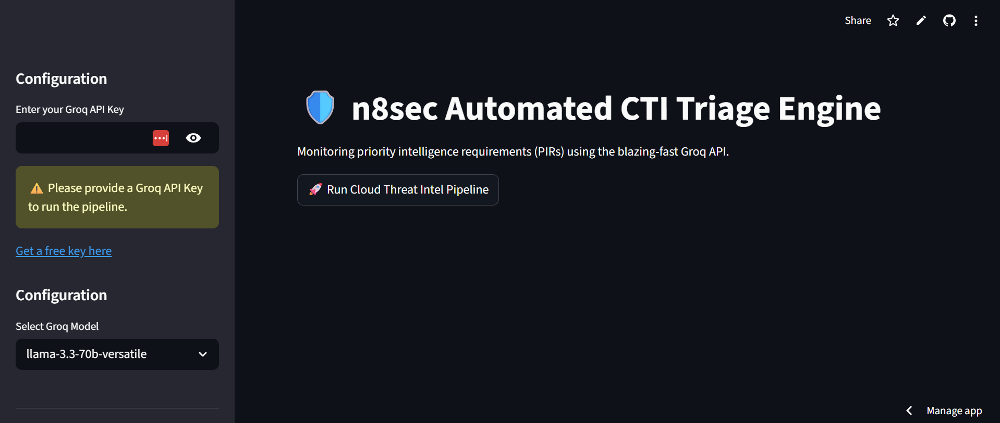

 # 🛡️ n8sec CTI Engine

# Try It Out Here: [](https://n8sec-cti.streamlit.app/)

 Requires a groq api > get one free here: https://console.groq.com/ 

A live dashboard for processing and analyzing threat intelligence data.
> Blazing-fast, LLM-powered Cyber Threat Intelligence triage and IOC extraction. 

The **n8sec CTI Engine** is an automated pipeline built for security analysts. It ingests the latest articles from 50+ top infosec RSS feeds, processes them through Groq's hyper-fast Llama models, and automatically maps emerging threats against custom Priority Intelligence Requirements (PIRs)—all wrapped in a clean, deployable Streamlit dashboard. This is experimental and caution should be used with IOC accuracy. The streamlit leverages human/AI code and AI models, so it is bound to be imperfect.

## ✨ Core Features
* **Automated Ingestion:** Scrapes and parses text from over 30 leading cybersecurity news sources and vendor blogs (BleepingComputer, Mandiant, Talos, CISA, etc.).
* **Speed-Optimized AI:** Utilizes the Groq API to process thousands of tokens in milliseconds, bypassing the heavy hardware requirements of local LLMs.
* **Deterministic Triage:** Employs a Decision Tree machine learning model to categorize incoming intelligence as `CRITICAL`, `MEDIUM`, or `DISCARD` based on IOC density and PIR relevance.
* **Smart IOC Extraction:** Automatically hunts for and extracts IPs, domains, and file hashes from unstructured text into copy-ready formats.
* **One-Click Export:** Compiles all discovered indicators from a scanning session into a clean CSV for immediate SIEM or firewall ingestion.

## ⚙️ Prerequisites
* Python 3.9+
* A free [Groq API Key](https://console.groq.com/) 

## 🚀 Installation & Setup

1. **Clone the repository:**
   ```bash
   git clone [https://github.com/MegaBitsnBytes/n8sec-cti-pipeline.git](https://github.com/MegaBitsnBytes/n8sec-cti-pipeline.git)
2. **Change directory to the repo location**
   ```bash
   cd n8sec-cti-pipeline
3. **Launch streamlit and run the python script**
   ```bash
   streamlit run cti_dashboard_cloud.p
   # If you run into issues with the streamlit run command try these commands:
   #py -m streamlit run cti_dashboard_cloud.py
   #python -m streamlit run cti_dashboard_cloud.py
   

# 
